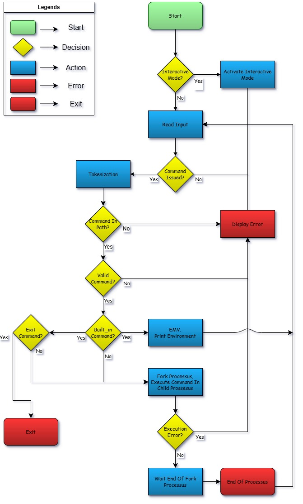

# C - Simple Shell

# Table of Contents

1. [Description](#description)
2. [Flowchart](#flowchart)
3. [Fonctionnalités](#fonctionnalités)
4. [Compilation](#compilation)
5. [Utilisation](#utilisation)
   - [Mode interactif](#mode-interactif)
   - [Mode non-interactif](#mode-non-interactif)
6. [Exigences du Projet](#exigences-du-projet)
7. [Liste des Fonctions et Appels Système Autorisés](#liste-des-fonctions-et-appels-système-autorisés)
8. [Auteurs](#auteurs)
9. [Références](#références)

## Description

Ce projet consiste à créer un interpréteur de commandes simple, similaire au shell UNIX traditionnel. L'objectif est de comprendre le fonctionnement interne des shells, d'apprendre à gérer les processus, les appels système, et à manipuler l'environnement d'exécution. Le projet suit les directives de style de code Betty et se conforme aux spécifications pour fonctionner sur Ubuntu 20.04 LTS.

## Flowchart


## Fonctionnalités

- **Exécution de commandes UNIX simples** : Le shell peut exécuter des commandes comme `ls`, `pwd`, `echo`, etc.
- **Mode interactif** : Le shell affiche un prompt, attend l'entrée de l'utilisateur, exécute la commande, puis affiche à nouveau le prompt.
- **Mode non-interactif** : Le shell peut recevoir des commandes via un fichier ou un pipe, les exécuter, puis se terminer.
- **Gestion des erreurs** : Les erreurs sont gérées et affichées de manière similaire à `/bin/sh`.
- **Support de l'environnement** : Le shell peut exécuter des commandes en utilisant les variables d'environnement comme `PATH`.
- **Commandes intégrées** :
  - `exit` : Ferme le shell.
  - `env` : Affiche l'environnement courant.

## Compilation

Pour compiler le projet, utilisez la commande suivante :

```bash
gcc -Wall -Werror -Wextra -pedantic -std=gnu89 *.c -o hsh
```

## Utilisation

### Mode interactif

Pour utiliser le shell en mode interactif :

```bash
$ ./hsh
($) /bin/ls
hsh main.c shell.c
($) exit
$
```

### Mode non-interactif

Pour utiliser le shell en mode non-interactif :

```bash
$ echo "/bin/ls" | ./hsh
hsh main.c shell.c
$
$ cat test_ls_2 | ./hsh
hsh main.c shell.c test_ls_2
$
```

## Exigences du Projet

- **Éditeurs autorisés** : `vi`, `vim`, `emacs`.
- **Compilation** : Le projet sera compilé sur Ubuntu 20.04 LTS avec `gcc` et les options `-Wall -Werror -Wextra -pedantic -std=gnu89`.
- **Normes de code** : Le code doit suivre les normes de style Betty.
- **Pas de fuites de mémoire** : Le shell doit être exempt de fuites de mémoire.
- **Include guards** : Tous les fichiers d'en-tête doivent être protégés contre les inclusions multiples.

## Liste des Fonctions et Appels Système Autorisés

- **Fonctions de la bibliothèque standard (`string.h`)** : Toutes les fonctions.
- **Appels système** : `access`, `chdir`, `close`, `execve`, `fork`, `getpid`, `isatty`, `kill`, `open`, `read`, `wait`, `write`, etc.
- **Fonctions de gestion de la mémoire** : `malloc`, `free`.
- **Fonctions de manipulation des chaînes** : `strtok`, etc.
- **Fonctions d'I/O** : `printf`, `fprintf`, `vfprintf`, `sprintf`, `fflush`, etc.

## Auteurs

- **Guney TASDELEN** <guney.tasdelen74@gmail.com>
- **José PUERTAS** <josefeliciano.com98@gmail.com>

## Références

- **[Unix Shell](https://en.wikipedia.org/wiki/Unix_shell)**
- **[Thompson Shell](https://en.wikipedia.org/wiki/Thompson_shell)**
- **[Ken Thompson](https://en.wikipedia.org/wiki/Ken_Thompson)**
